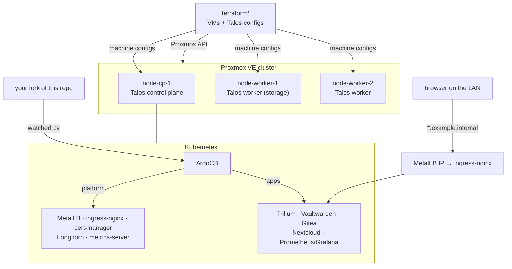

# homelab-starter

A self-hosted homelab you can rebuild from git: **Talos Linux** VMs on **Proxmox VE**, created
with **Terraform**, managed with **ArgoCD** (GitOps), running Trilium, Vaultwarden, Gitea,
Nextcloud and a Prometheus/Grafana stack on Longhorn storage behind ingress-nginx and MetalLB.

It is extracted from a homelab that has been running these services, with every secret and
site-specific value replaced by a placeholder. **There are no credentials in this repo, and
nothing in it needs them to be committed.**

## Architecture



```
Proxmox VE ──terraform──> Talos VMs ──talosctl bootstrap──> Kubernetes
                                                             │
           your git fork ──────────watched by──────────> ArgoCD
                                                             ├─ bootstrap/platform/  MetalLB, ingress-nginx,
                                                             │                       cert-manager, Longhorn, metrics-server
                                                             └─ apps/                Trilium, Vaultwarden, Gitea,
                                                                                     Nextcloud, kube-prometheus-stack
```

## Stack

| Layer | Component | Version |
|---|---|---|
| Hypervisor | Proxmox VE | 8.x |
| Provisioning | Terraform + `bpg/proxmox` + `siderolabs/talos` | >= 1.5, `~> 0.116`, `~> 0.11.0` |
| OS / Kubernetes | Talos Linux | v1.7.6 (variable) |
| GitOps | ArgoCD | 2.x (installed from upstream manifest) |
| Load balancer | MetalLB (L2) | chart 0.14.8 |
| Ingress | ingress-nginx | chart 4.11.2 |
| Certificates | cert-manager, self-signed ClusterIssuer | chart v1.15.3 |
| Storage | Longhorn | chart 1.7.1 |
| Metrics | metrics-server | chart 3.12.1 |
| Monitoring | kube-prometheus-stack | chart 62.3.1 |
| Apps | Gitea / Nextcloud | charts 10.4.0 / 6.0.0 |
| Apps | Trilium / Vaultwarden | plain manifests, images `:latest` (see their READMEs) |

## Repository layout

```
.
├── terraform/      Proxmox VMs + Talos secrets and machine configs (variables for every node)
├── talos/          patches, Image Factory schematic, sanitized reference configs, how-to
├── bootstrap/      ArgoCD install steps, app-of-apps, platform charts (bootstrap/platform/)
├── apps/           one directory per app: kustomization, manifests, README
├── docs/           lessons learned
├── VALUES.md       every placeholder: what to put there and where it appears
└── SECRETS.md      every Secret you create, with the kubectl command
```

## Prerequisites

* A Proxmox VE cluster (one node is enough) with about 12 vCPU, 24 GiB RAM and 250 GB disk free
  for the default layout (see `talos/README.md` for smaller layouts).
* A Proxmox API token that can create VMs and upload ISOs (`terraform/README.md`).
* A LAN with static addresses for the nodes and a small free range for MetalLB, outside DHCP.
* DNS (or `/etc/hosts`) you can point `*.example.internal`, or your own domain, at one IP.
* On your workstation: `terraform`, `talosctl` (same minor version as Talos), `kubectl`, `git`,
  `openssl`.
* Somewhere ArgoCD can read your fork from: GitHub, or a Gitea you already run.

## Quickstart

1. **Fork** this repo and clone your fork.
2. **Fill in the values.** Work through [VALUES.md](VALUES.md): node names, IPs, domain,
   MetalLB range, your fork's URL in `bootstrap/*.yaml`. Commit and push.
3. **Configure Terraform:** `cd terraform && cp terraform.tfvars.example terraform.tfvars`, then
   edit it (Proxmox endpoint and token, `nodes`, network). The file is git-ignored.
4. **Create the VMs:** `terraform init && terraform apply`. The VMs boot the Talos ISO; their
   machine configs land in `terraform/_out/` (git-ignored).
5. **Install Talos:** `talosctl apply-config --insecure` each node's config, then
   `talosctl bootstrap` once and `talosctl kubeconfig` ([talos/README.md](talos/README.md)).
   Keep `talosconfig` and the kubeconfig outside the repo.
6. **Install ArgoCD** from its upstream manifest ([bootstrap/README.md](bootstrap/README.md)).
7. **Create the Secrets** listed in [SECRETS.md](SECRETS.md) with `kubectl create secret`.
8. **Hand over to GitOps:** `kubectl apply -k bootstrap/`. ArgoCD installs the platform, then
   every app under `apps/`.
9. **Wait for green:** `kubectl -n argocd get applications` until all are `Synced`/`Healthy`;
   point your DNS at the ingress IP from `kubectl -n ingress-nginx get svc`.
10. **Log in and lock down:** change the ArgoCD admin password and delete
    `argocd-initial-admin-secret`; set your Trilium password; create your Vaultwarden account
    and then set `SIGNUPS_ALLOWED=false`.

From here on every change is a commit: edit a manifest, push, and ArgoCD applies it.

## How secrets are handled

* **Nothing secret is committed.** Charts take credentials from `existingSecret`; plain
  manifests use `secretKeyRef`. [SECRETS.md](SECRETS.md) lists each Secret's namespace, name
  and keys, and the command that creates it.
* **Generated credentials stay local.** Terraform state (it contains the Talos PKI),
  `terraform.tfvars`, `_out/` machine configs, `talosconfig` and kubeconfigs are all in
  [.gitignore](.gitignore).
* **Upgrade path:** Sealed Secrets, SOPS or External Secrets Operator let you keep encrypted
  Secrets in git; the names and keys stay the same.

## Apps

| App | URL | README |
|---|---|---|
| ArgoCD | `https://argocd.example.internal` | [bootstrap/](bootstrap/README.md) |
| Trilium | `https://trilium.example.internal` | [apps/trilium](apps/trilium/README.md) |
| Vaultwarden | `https://vaultwarden.example.internal` | [apps/vaultwarden](apps/vaultwarden/README.md) |
| Gitea | `https://gitea.example.internal` | [apps/gitea](apps/gitea/README.md) |
| Nextcloud | `https://nextcloud.example.internal` | [apps/nextcloud](apps/nextcloud/README.md) |
| Grafana | `https://grafana.example.internal` | [apps/monitoring](apps/monitoring/README.md) |

To drop an app, comment it out in `apps/kustomization.yaml` and push. To add one, create
`apps/<name>/` with a `kustomization.yaml` and list it there.

## Known limitations

* Certificates are self-signed. Browsers warn, and Bitwarden clients need the certificate
  trusted. Swap in an ACME issuer for a domain you own.
* Trilium, Vaultwarden and the bundled PostgreSQL images use `:latest`; pin tags you have tested.
* Longhorn defaults to one replica per volume, and its snapshots are local. Add a backup
  target before trusting it with data you cannot lose.
* Prometheus has no persistent volume by default.

More context in [docs/lessons-learned.md](docs/lessons-learned.md).

## Contributing

Issues and pull requests are welcome.

* Keep it secret-free: placeholders only, in the styles listed in [VALUES.md](VALUES.md)
  (`REPLACE_ME_*`, `example.internal`, `192.0.2.x`). Add any new placeholder to that table and
  any new Secret to [SECRETS.md](SECRETS.md).
* Before opening a PR, run what CI runs:
  `gitleaks detect --source . -v`, `terraform -chdir=terraform fmt -check -recursive`,
  `terraform -chdir=terraform validate`, and `kubectl kustomize` on every directory you changed.
* Pin chart versions (`targetRevision`) and say in the app README why if an image stays unpinned.
* One app per directory, with a README that says what it is, which values to change, which
  Secrets to create, and how much CPU, memory and disk it needs.

## License

[MIT](LICENSE)
